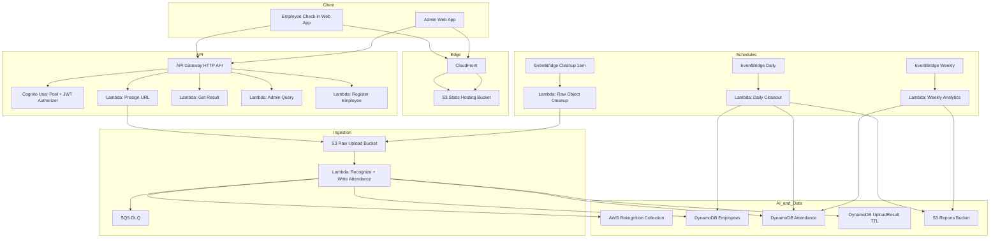

# Serverless Attendance System with Face Recognition

Production-ready AWS implementation of a real-time, contactless attendance system using Rekognition, Lambda, DynamoDB, S3, API Gateway, Cognito, and CloudFront.

## High-level architecture

## What is implemented

- CDK stack with env-aware naming (`dev`, `staging`, `prod`)
- KMS-encrypted DynamoDB and S3 buckets
- Cognito user pool and JWT authorizer on API Gateway
- Lambda functions:
  - `presign-upload-url`
  - `get-upload-result`
  - `register-employee`
  - `recognize-attendance`
  - `admin-query-attendance`
  - `daily-closeout`
  - `weekly-analytics`
  - `raw-object-cleanup`
- S3 event trigger from raw uploads to recognition Lambda
- EventBridge schedules for daily/weekly jobs and 15-min raw cleanup
- Static frontend (`web/`) for employee kiosk and admin view

## Repository structure

- `bin/` CDK entrypoint
- `lib/` CDK stack
- `services/` Lambda code
- `web/` static frontend
- `docs/architecture.md` design details
- `docs/runbook.md` ops guide
- `scripts/register_employee.sh` registration helper

## Deployment steps (exact order)

1. Install dependencies:
   - `npm install`
2. Bootstrap CDK (first time per account/region):
   - `npx cdk bootstrap aws://<ACCOUNT_ID>/ap-south-1`
3. Deploy dev stack:
   - `npm run cdk:deploy:dev -- -c env=dev -c region=ap-south-1`
4. Create Rekognition collection once (from stack output):
   - `aws rekognition create-collection --collection-id <OUTPUT_COLLECTION_ID> --region ap-south-1`
5. Create Cognito users and add admin users to group `admin`.
6. Update `web/js/config.js` with:
   - `API_BASE_URL` from stack output
   - valid Cognito `ID_TOKEN`
7. Open CloudFront URL from stack output and test employee + admin flows.

## API contracts

- `POST /upload-url` -> `{ upload_id, s3_key, upload_url }`
- `GET /result/{upload_id}` -> pipeline result or `PENDING`
- `POST /admin/register-employee` (admin) -> register/index face
- `GET /admin/attendance` (admin) with filters:
  - `employee_id`, `date_from`, `date_to`, `status`, `limit`

## Attendance logic

- First successful recognition on a date -> `CLOCK_IN`
- Second successful recognition on same date -> `CLOCK_OUT`
- Additional recognitions -> `ALREADY_COMPLETE`
- Daily closeout inserts `ABSENT` for active employees with no record

## Security controls

- Least-privilege grants per Lambda role via CDK
- Cognito JWT on all APIs
- Admin group enforced in admin Lambdas
- Encryption at rest (S3 + DynamoDB)
- Raw captures auto-cleaned every 15 minutes for objects older than 1 hour

## Cost model (estimate: 100 employees, 2 scans/day)

- Rekognition search dominates costs
- Lambda + DynamoDB + S3 + CloudFront are low at this scale
- Keep 20-30% budget buffer for retries and extra scans

Use AWS Pricing Calculator with your region and observed request volumes for final numbers.

## Acceptance test checklist

- Known employee recognized in <= 3 seconds end-to-end
- Unknown/no-face handled with clear response
- Clock-in/clock-out/already-complete transitions work
- Daily absent marking is idempotent
- Weekly percentages are accurate vs attendance table
- Unauthorized requests are blocked
- Raw uploads older than one hour are deleted
- Failed recognition events are visible in DLQ

## Notes

- WAF and organization-level controls (CloudTrail org trail, Config org rules, Budgets) are account/governance level and should be provisioned in your security baseline stack.
- Rekognition collection creation is intentionally externalized as a one-time operation.
